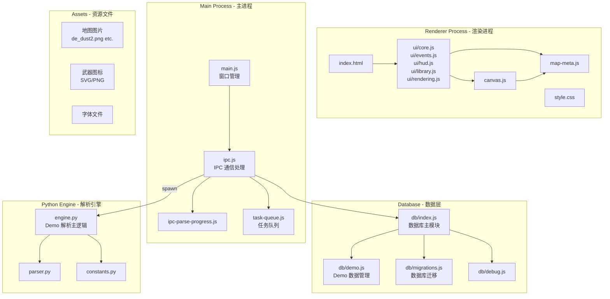
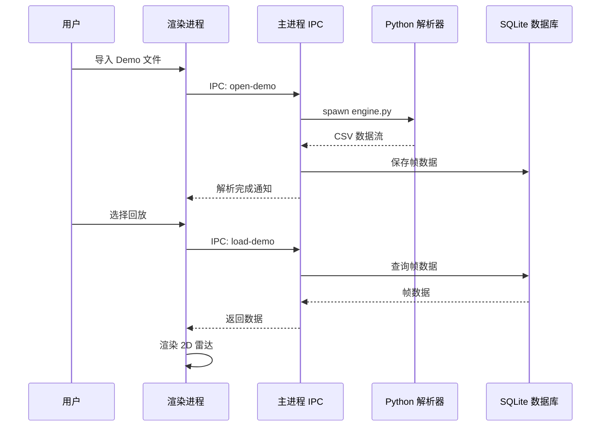

# CS2 Demo Player 项目架构分析

## 项目概述

这是一个基于 **Electron** 的 CS2（Counter-Strike 2）比赛 Demo 文件播放和分析工具，支持 2D 雷达视角回放。

---

## 技术栈

| 层级 | 技术 |
|------|------|
| 桌面框架 | Electron v29 |
| 前端 | 原生 HTML/CSS/JavaScript |
| 数据库 | sql.js（SQLite 的 JavaScript 实现） |
| Demo 解析 | Python + demoparser2 |

---

## 架构图



---

## 模块详解

### 1. 主进程模块 (src/main/)

#### [`main.js`](src/main/main.js)
- Electron 应用入口
- 创建 1600x900 的浏览器窗口
- 加载渲染进程的 HTML 页面
- 配置 `nodeIntegration: true` 和 `contextIsolation: false`

#### [`ipc.js`](src/main/ipc.js)
- 处理渲染进程的 IPC 请求
- 调用 Python 解析引擎处理 demo 文件
- 管理 demo 文件的导入、解析、缓存
- 支持批量解析，最大并发数 6

#### [`ipc-parse-progress.js`](src/main/ipc-parse-progress.js)
- 构建解析进度消息
- 构建解析完成的数据负载

#### [`task-queue.js`](src/main/task-queue.js)
- 任务队列管理
- 控制解析任务的并发执行

### 2. 数据库模块 (src/main/db/)

#### [`index.js`](src/main/db/index.js)
- 数据库初始化和连接管理
- 使用 sql.js（SQLite 的 JavaScript 实现）
- 数据库文件存储在 `data/cs2-demo-player.sqlite`
- 提供 CSV 导入功能

#### [`demo.js`](src/main/db/demo.js)
- Demo 文件的 CRUD 操作
- Demo 索引管理
- 回放帧数据存储

#### [`migrations.js`](src/main/db/migrations.js)
- 数据库版本迁移
- 表结构升级

### 3. Python 解析引擎 (src/python/)

#### [`engine.py`](src/python/engine.py)
- 使用 `demoparser2` 库解析 CS2 demo 文件
- 输出 CSV 格式的数据：
  - `player_positions.csv` - 玩家位置
  - `kills.csv` - 击杀事件
  - `grenades.csv` - 手雷投掷
  - `grenade_events.csv` - 手雷事件
  - `bomb_events.csv` - 炸弹事件
  - `round_meta.csv` - 回合元数据
- 支持固定帧率（8 tick）输出

#### [`parser.py`](src/python/parser.py)
- 解析器辅助功能

#### [`constants.py`](src/python/constants.py)
- 常量定义

### 4. 渲染进程模块 (src/renderer/)

#### [`index.html`](src/renderer/index.html)
- 主界面布局
- 包含两个视图：
  - **Home View**: Demo 库管理界面
  - **Replay View**: 回放界面

#### [`js/ui/core.js`](src/renderer/js/ui/core.js)
- UI 核心逻辑
- DOM 元素引用
- 地图状态管理
- 回放控制（播放/暂停/进度）
- 颜色配置（手雷颜色、效果配置）

#### [`js/ui/events.js`](src/renderer/js/ui/events.js)
- 用户交互事件处理

#### [`js/ui/hud.js`](src/renderer/js/ui/hud.js)
- HUD（抬头显示）渲染

#### [`js/ui/library.js`](src/renderer/js/ui/library.js)
- Demo 库界面逻辑

#### [`js/ui/rendering.js`](src/renderer/js/ui/rendering.js)
- 渲染逻辑

#### [`js/canvas.js`](src/renderer/js/canvas.js)
- Canvas 绑定和初始化

#### [`js/map-meta.js`](src/renderer/js/map-meta.js)
- 地图元数据（坐标转换、缩放比例）

---

## 数据流



---

## 核心功能

### 1. Demo 解析
- 支持导入 `.dem` 文件
- 自动计算文件校验和去重
- 批量解析支持（最大并发 6）

### 2. 回放功能
- 2D 雷达视角显示
- 玩家位置追踪
- 手雷轨迹和效果显示
- 击杀事件标注
- 炸弹事件显示

### 3. Demo 库管理
- Demo 文件存储和索引
- 重命名/删除功能
- 解析状态跟踪（UNPARSED → INDEX_ONLY → PARTIAL_CACHE → FULL_CACHE）

---

## 目录结构

```
CS2DemoPlayer/
├── package.json              # 项目配置
├── requirements.txt          # Python 依赖
├── data/                     # 数据目录（运行时生成）
│   └── cs2-demo-player.sqlite
├── src/
│   ├── main/                 # 主进程
│   │   ├── main.js          # 入口
│   │   ├── ipc.js           # IPC 处理
│   │   ├── ipc-parse-progress.js
│   │   ├── task-queue.js
│   │   └── db/              # 数据库模块
│   │       ├── index.js
│   │       ├── demo.js
│   │       ├── migrations.js
│   │       └── debug.js
│   ├── python/              # Python 解析引擎
│   │   ├── engine.py
│   │   ├── parser.py
│   │   └── constants.py
│   └── renderer/           # 渲染进程
│       ├── index.html
│       ├── css/style.css
│       ├── js/
│       │   ├── canvas.js
│       │   ├── map-meta.js
│       │   └── ui/
│       │       ├── core.js
│       │       ├── events.js
│       │       ├── hud.js
│       │       ├── library.js
│       │       └── rendering.js
│       └── assets/
│           ├── maps/         # 地图图片
│           ├── icons/        # 武器图标 SVG
│           └── icons/weapons-png/
└── plans/                    # 计划文档
```

---

## 依赖关系

### Node.js 依赖
- `electron`: ^29.0.0
- `sql.js`: ^1.14.0

### Python 依赖
- `demoparser2`: CS2 Demo 解析库

---

## 扩展建议

如需扩展此项目，可考虑以下方向：

1. **新增地图支持**: 在 `src/renderer/js/map-meta.js` 添加地图元数据
2. **新增事件类型**: 在 `src/python/engine.py` 添加事件解析逻辑
3. **UI 增强**: 在 `src/renderer/js/ui/` 中扩展交互功能
4. **数据导出**: 在 `src/main/ipc.js` 添加导出功能